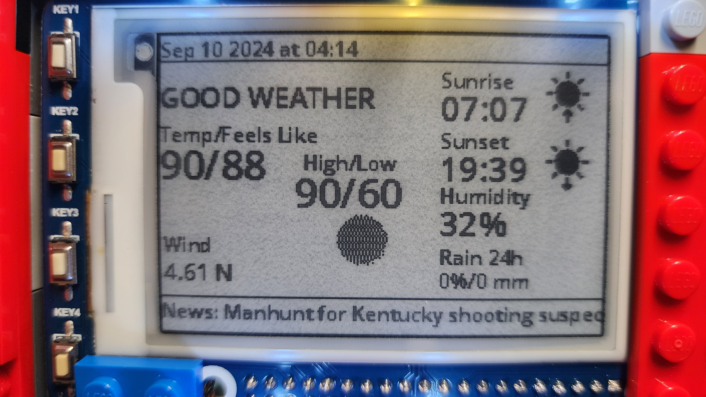
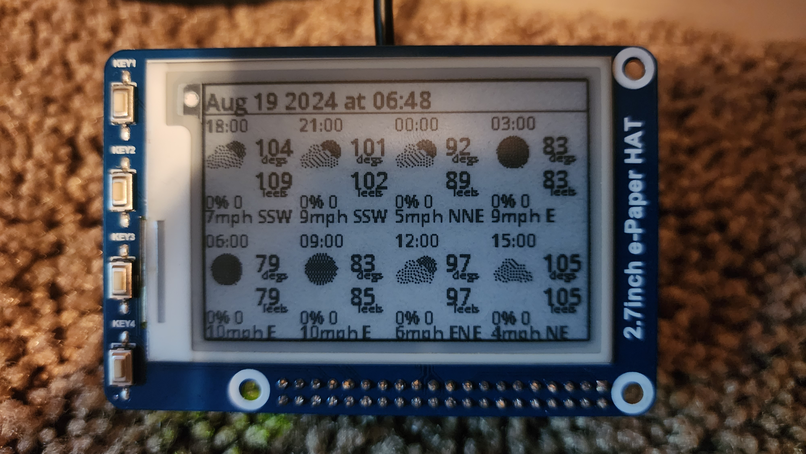
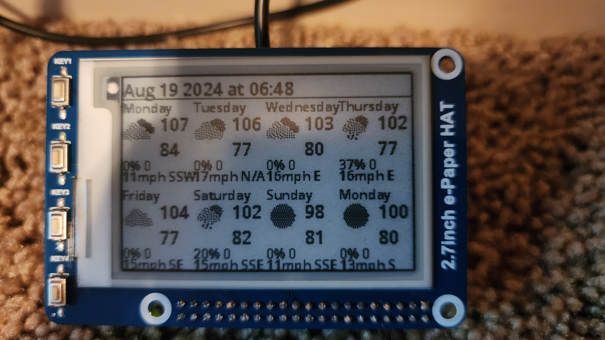
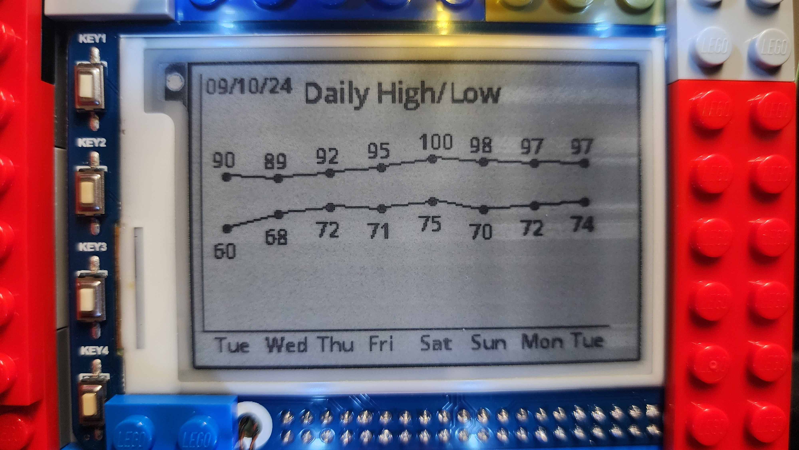

# Current and Forecast Weather Display Station
This project is derived from and significantly enhanced from a weather station project described here:

https://www.hackster.io/aerodynamics/weather-and-news-station-e-paper-and-raspberry-pi-a19fa3

## For this project you will need:
- Raspberry Pi Zero 2 W or a more powerful Raspberry Pi
- Waveshare 2.7in E-paper display with 4 buttons
- MicroSD card (I used a 32GB SanDisk Ultra)
- USB Keyboard (to plug into the Raspberry Pi to configure OS)
- Laptop (to format SD Card with Raspberry Pi image and run Github runner on WSL)

The documentation is for a Raspberry Pi Zero 2 W with soldered pins. You can get one without soldered pins as well if you have the appropriate equipment and expertise. 
As far as I know it won't run on anything other than a Raspberry Pi since it needs the proper GPIO socket.

I made changes to allow for a 2.7in (254x176) or a 7.5in (800x480) Waveshare e-ink display.

- https://www.waveshare.com/product/raspberry-pi/displays/e-paper/2.7inch-e-paper-hat.htm
- https://www.waveshare.com/product/raspberry-pi/displays/e-paper/7.5inch-e-paper-hat-b.htm

I also set up a process to download weather icons if needed.

# Steps
## Format MicroSD card and install OS
1. Plugin MicroSD to laptop. 
2. Download and Install Raspberry Pi Installer (https://www.raspberrypi.com/software/)
3. Execute Installer
4. Select correct Raspberry Pi Device, OS, and Storage
5. Modify OS Customization as desired. I recommend setting locale, SSID, username, name, Enable SSD (public-key only and capture the key) to what makes sense for you.
6. Save Settings and continue
## Configure OS on Raspberry Pi
1. Setup ssh keys for ID with sudo access
## Configure Github Runner on Windows WSL and connection to Raspberry Pi
1. Install Github Runner on local unix device or a WSL
2. Setup SSH keys
3. Use Raspberry Pi Keys and WSL Keys to setup passwordless login from WSL for 
## Install E-Paper Display on Raspberry Pi
1. Physically attach the display to the Raspberry Pi
## Run Deploy process to setup Weather Display
1. Update the proper vars in your environment, Application Directory, Weather API Key, and News API Key
2. Execute Action to Deploy the Weather Station.

# It should look something like this when you turn it on 
( I can provide information on the lego case if you are interested)

# When you click the top button it would have the same screen

# The second button would look like this (Forecast in 3 hour increments):

# The third button would look like this (Forecast by day):

# The fourth button would look like this (Forecast by day graph):

